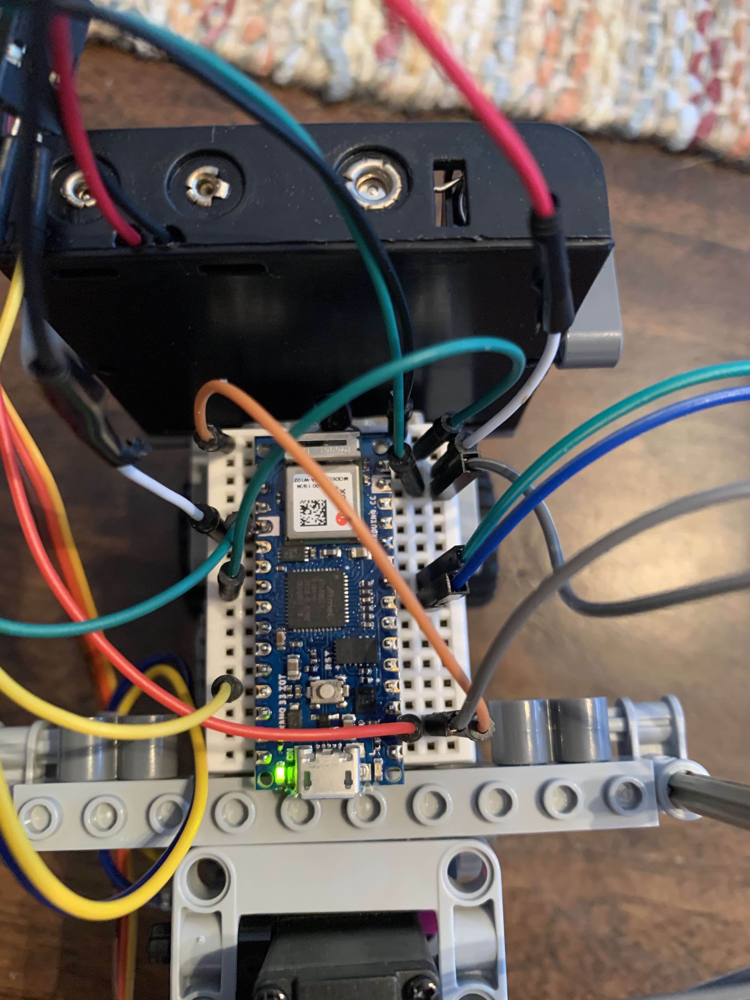
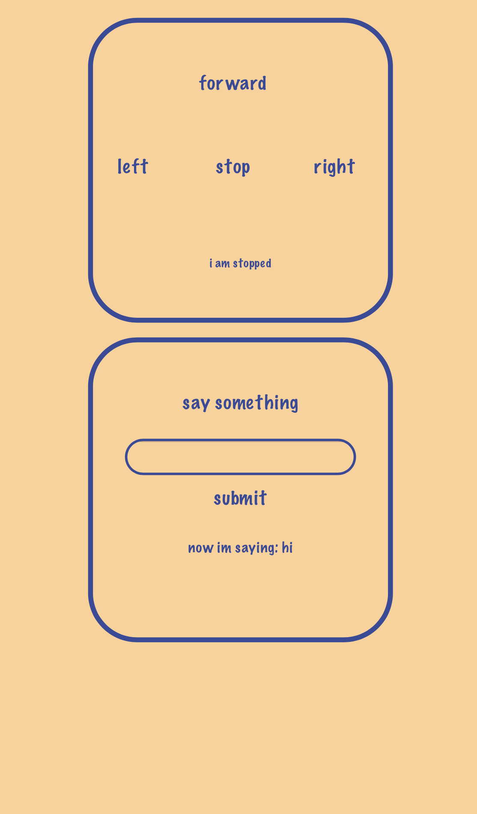

# Arduino-Iot-Robot
### This project documents a fun little robot with an OLED face that says whatever you want. It has a servo steering in the front and DC motor to drive, with an Arduino Nano 33 iot for brains

The nano is attached to a breadboard for easy connection to the motors and display. The DC motor is attached to pin 4 with a PNP transister for more current, servo to pin 9, and display to A4 and A5. There is also a 4 AA battery pack on the back, connected to vin and ground pins for enough cuurent, as shown below:

When booted up, the robot will display "connecting" and then an IP address for the user to go to, to access the website

Screenshot of the website from a mobile device:

When a user does connect, the robots face and text can be seen:

[Here it is in action!](https://www.google.com "Google's Homepage")

